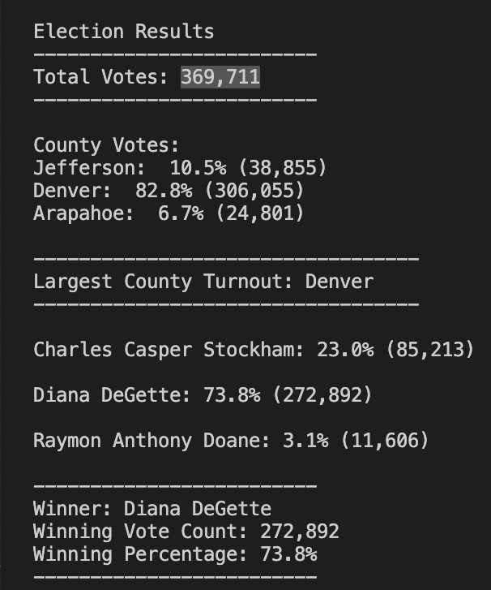

# Election_Analysis

## Overview of Election Audit
A Colorado Board of Elections has given the following tasks to complete the election audit of a recent local congressional eletion by using Python.

1. Calculate the toal number of votes cast.
2. Get a comoplet list of candidates who received votes.
3. Caluculate the total number of votes each condidate received.
4. Calculate the percentage of votes easch candidate won. 
5. Determine the winner of the election based on popular vote. 
6. The voter turnout for each county.
7. The percentage of votes from each county out of the total count.
8. The county with the highest turnout.

## Resources
- Data Source: [election_results.csv](Resources/election_results.csv)
- software: Python 3.8.8

## Election-Audit Results
The analysis of the election, [PyPoll_Challenge.py](PyPoll_Challenge.py), shows in [election_results.txt](analysis/election_results.txt) that:

-  There were 369,711 votes cast in the election. 
         
         # To get total votes. 
         
         # 1.Initialize a total vote counter.
         total_votes = 0
         
             # 2.For each row in the CSV file.
             for row in reader:
         
                 # 3.add to the total vote count
                 total_votes = total_votes + 1
             
             # 4. Print the final vote count.
              election_results = (
                  f"\nElection Results\n"
                  f"-------------------------\n"
                  f"Total Votes: {total_votes:,}\n"
                  f"-------------------------\n\n"
                  f"County Votes:\n")
              print(election_results, end="")
               
   
-  The county vote results were:
   - Jefferson had 10.5% of the vote and 38,855 votes.
   - Denver had 82.8% of the vote and 306,055 votes.
   - Arapahoe: 6.7% of the vote and 24,801 votes.

          # To get the number of total votes for each county.
         
          # 1.Create a county list and county votes dictionary.
          county_names = []
          county_votes = {}
                
              # 2. For each row in the CSV file.
              for row in reader:
                   
                  # 3. Write an if statement that checks that the
                  # county does not match any existing county in the county list.
                  if county_name not in county_names:

                      # 4. Add the existing county to the list of counties.
                      county_names.append(county_name)

                      # 5. Begin tracking the county's vote count.
                      county_votes[county_name]=0

                  # 6. Add a vote to that county's vote count.
                  county_votes[county_name] += 1
                  
                  
          # To get the percentage of total votes for each county.
              
               # 7. Write a for loop to get the county from the county dictionary.
              for county_name in county_votes:
                   
                  # 8. Retrieve the county vote count.
                  county_vote = county_votes[county_name]
                   
                  # 9. Calculate the percentage of votes for the county.
                  county_percent = int(county_vote)/int(total_votes)*100
                  
                  # 10. Print the county results.
                  county_results=(f"{county_name}: {county_percent: .1f}% ({county_vote:,})\n")
                  print(county_results, end ="")
            
- The county that had the largest number of votes:
   - Denver, which had 82.8% of the vote and 306,055 votes.

           # To find the county that had the largest number of votes.
           
              # 1. In the for loop from county dictionary.
              for county_name in county_votes:
                   
                  # 2. Write an if statement to determine the winning county and get its vote count.
                  if (county_vote > largest_county_votes):
                       largest_county_votes = county_vote
                       largest_county_turnout = county_name
                       
              # 3. Print the county with the largest turnout
              largest_county_turnout = (
                  f"\n----------------------------------\n"
                  f"Largest County Turnout: {largest_county_turnout}\n"
                  f"----------------------------------\n"
              )
               
               
- The candidate results were:
   - Charles Casper Stockham: 23.0% (85,213)
   - Diana DeGette: 73.8% (272,892)
   - Raymon Anthony Doane: 3.1% (11,606)
            
            # To find the number of votes and the percentage of the total votes each candidate received.
            
              # 1. In the for loop.
              for candidate_name in candidate_votes:
              
              # 2. Retrieve vote count and percentage
                  votes = candidate_votes.get(candidate_name)
                  vote_percentage = float(votes) / float(total_votes) * 100
                  
              # 3. Print candidate results.
                  candidate_results = (
                           f"{candidate_name}: {vote_percentage:.1f}% ({votes:,})\n")
                  print(candidate_results)
                           
            
            
- The winner of the election was:
   - Diana DeGette, who received 73.8% of the vote and 272,892 number of votes.

              # To determine winning vote count, winning percentage, and candidate.
                  
              # 1. In the for loop.
              for candidate_name in candidate_votes:
                
                  # 2. write if statement.
                  if (votes > winning_count) and (vote_percentage > winning_percentage):
                       winning_count = votes
                       winning_candidate = candidate_name
                       winning_percentage = vote_percentage

              # 3. Print the winning candidate.
              winning_candidate_summary = (
                  f"-------------------------\n"
                  f"Winner: {winning_candidate}\n"
                  f"Winning Vote Count: {winning_count:,}\n"
                  f"Winning Percentage: {winning_percentage:.1f}%\n"
                  f"-------------------------\n")
              print(winning_candidate_summary)

                  
   
** All codes are retrieved and dissected from [PyPoll_Challenge.py](PyPoll_Challenge.py)

## Election-Audit Summary
From the analysis above, we can provide a business proposal to the election commission on how this script can be used for any election. By using python, this script can be used with any election data with the same header of [election_results.csv](Resources/election_results.csv) which included "Ballot ID", "County" and "Candidate" in that order. In the header, there are three variables. Every "ballot ID" is unique, so we can discard it for consideration to make examples.  The first example to use the script is in an election of a different congressional district in Colorado. There would be different County names like Bent, Cheyenne, Crowley, Elbert, Kiowa, Kit Carson, etc.  Although county names are different, still the code will work by modifying the county names in the "County" column. And the second example would be in a different election type like the state's governor election. Then, in the "Candidate" column, the candidate names would be Jared Polis, Cary Kennedy, Mike Johnston, or Donna Lynne. Although the example candidate names are different from ones in the given election data, we can use the code by modifying the candidate names in the "Candidate" column. To conclude, this script can automate the process by using python in any district/state or any type of election since both "County" and "Candidate" columns can be modified. 
